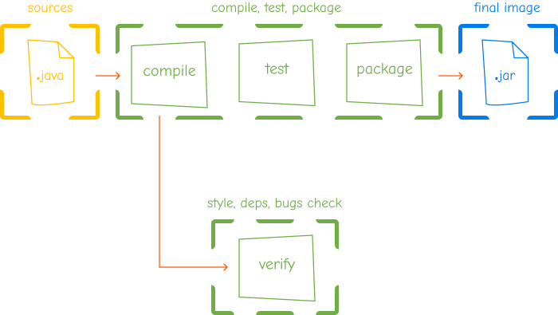

Теги: `Docker` `Java` `Maven`

# BuildKit Parallelization

Разработчики проекта хотят ускорить сборку и прохождение проверок (авто-тесты, проверка CodeStyle, зависимостей и т.д.) и обратились к вам, как к эксперту по Docker, системам сборки и прочему (включая выстраивание оптимальных процессов)

Мотивация: авто-тесты, как и проверка зависимостей на уязвимости (и другие активности), могут проходить достаточно долго, поэтому почему бы их не распараллелить

**Что нужно сделать**: используя возможности [BuildKit](https://docs.docker.com/build/buildkit/) распараллелить сборку (компиляцию исходников и сборку Uber JAR) и служебные задачи вроде проверки CodeStyle, Unit-тестов и т.д.

Желаемый вид:



**Важно**: `pom.xml` редактировать нельзя

*Q*: почему инструменты верификации нужно запускать после компиляции?

*A*: некоторые из них (например, SpotBugs) работают на уровне байт-кода, кроме того, проверять стиль кодирования имеет смысл только в случае, если код хотя бы компилируется, поэтому мы упростили задачу и не предлагаем вам детально разбираться в том, что конкретный плагин требует (только исходников или ещё и байт-код)

## Инструкции по [сборке проекта](https://maven.apache.org/guides/introduction/introduction-to-the-lifecycle.html)

Текущая сборка описана в файле [`Dockerfile`](Dockerfile), сборка производится командой:

```shell
docker buildx build .
```

Используемые переменные окружения:
* `APP_SIGN_ALGO` &mdash; алгоритм генерации [HMAC](https://www.rfc-editor.org/rfc/rfc2104) (в терминах разработчика &mdash; "подписи")
* `APP_SIGN_KEY` &mdash; ключ для генерации [HMAC](https://www.rfc-editor.org/rfc/rfc2104) (в терминах разработчика &mdash; "подписи")

Используемый порт: `8080`

Команда для тестирования:
```shell
curl -X POST http://localhost:8080 -d 'secret'
```

Ожидаемый ответ:
```shell
b4a5151c4d6939f8df7febe32ac94c3ce0f61112cbe1d8df0e51d7f2c4d9618b
```

## Подсказки

Если очень-очень верхнеуровнево, то:

1. `./mvnw package` &mdash; компиляция, Unit-тесты, сборка Uber JAR
2. `./mvnw verify` &mdash; `package` + проверка CodeStyle, проверка уязвимых зависимостей, поиск багов

Детали см. в [Maven Default Lifecycle](https://maven.apache.org/guides/introduction/introduction-to-the-lifecycle.html#default-lifecycle)

**Важно**: убедитесь, что вынесенные в "параллельные" stage активности действительно отрабатывают

<details>
<summary>Спойлеры</summary>

Вполне возможно, что BuildKit оптимизирует сборку таким образом, что при определённых условиях "параллельные" stage запускаться не будут
</details>

## Реализация

В качестве реализации CI/CD пайплайна и Docker Registry можно использовать любые, например (из облачных и бесплатных), [GitHub Actions](https://docs.github.com/en/actions) и [GitHub Packages](https://docs.github.com/packages)

# Разборы

* 24.10.2023 &ndash; Максим Суслов ([Видео на YouTube](https://www.youtube.com/watch?v=VVSLdUfa_Js), [Репо на GitHub](https://github.com/maxx27/slurm-devopscases/tree/buildkit-parallelization-solution))
